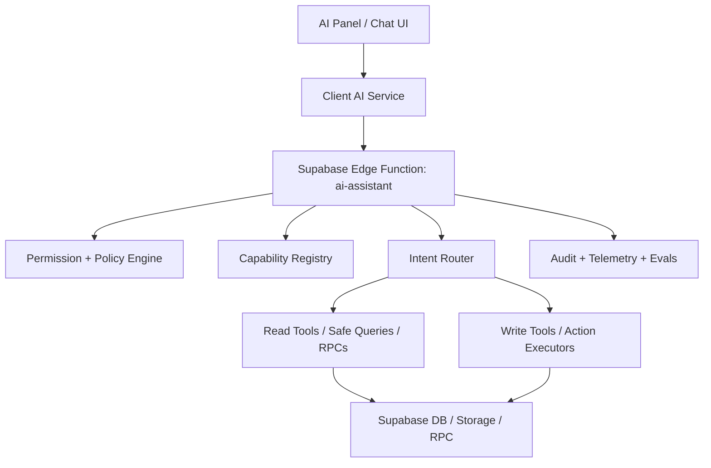

# AI Assistant Architecture

## Objective

Build the AI assistant as a controlled application operator inside QMS, not as a generic chatbot.

The assistant must:

- answer from live system data when possible
- refuse clearly when data is unavailable or access is not allowed
- respect the same company, department, and role boundaries as the current user
- execute only approved actions through explicit tools
- produce auditable behavior for every read and write path

## Current Baseline In This Repo

The current implementation already provides a useful starting point:

- UI panel and thread/message history in [src/components/chat/AiAssistantPanel.tsx](c:\Users\abdal\Downloads\QMS\src\components\chat\AiAssistantPanel.tsx)
- client-side service in [src/services/aiAssistantService.ts](c:\Users\abdal\Downloads\QMS\src\services\aiAssistantService.ts)
- settings service in [src/services/aiAssistantSettingsService.ts](c:\Users\abdal\Downloads\QMS\src\services\aiAssistantSettingsService.ts)
- main Edge Function in [supabase/functions/ai-assistant/index.ts](c:\Users\abdal\Downloads\QMS\supabase\functions\ai-assistant\index.ts)

The assistant already supports:

- `threads/messages`
- provider-backed chat
- permission checks for `ai_assistant`
- direct structured data queries for selected safe cases
- a proposal-oriented execution model

This means the next step is not "training from zero". The real task is to turn the existing assistant into a governed orchestration layer.

## Core Principle

Do not rely on model memory for application truth.

Split assistant knowledge into four layers:

1. Static application knowledge
2. Live data access
3. Action execution tools
4. Policy, approval, and audit

## Target Architecture



## Layer 1: Static Application Knowledge

This layer teaches the assistant what the application is and how it is organized.

It should contain:

- module map
- route map
- service map
- business glossary
- approved entity names and synonyms
- permission vocabulary

Recommended artifacts:

- `docs/ai-assistant-architecture.md`
- `docs/ai-assistant-tool-inventory.md`
- `docs/ai-assistant-rollout-plan.md`
- `src/ai/capabilityRegistry.ts`
- `src/ai/businessGlossary.ts`
- `src/ai/moduleMap.ts`

The business glossary is mandatory because many user prompts are Arabic business language, while the database often uses English or mixed naming.

Examples:

- `الدقيق`, `طحين`, `flour`
- `استلام`, `استلام خامات`, `material receiving`
- `مورد معتمد`, `approved supplier`
- `عدم مطابقة`, `NCR`

## Layer 2: Live Data Access

This is the most important layer for correctness.

The assistant must answer from live tools, not from free-form model guessing.

Data access should be split into:

- structured database tools for entities and counts
- document search tools for policies, SOPs, and instructions
- narrow RPCs for business questions that are frequent or expensive

Rules:

- read tools return structured JSON
- each tool is scoped by company and permission
- sensitive fields are excluded by design
- "no result" is a valid result and must be surfaced honestly

## Layer 3: Action Execution

Actions must never be free-text hallucinations.

Every write operation must map to an explicit tool such as:

- `create_ncr`
- `update_task_status`
- `create_material_receiving`
- `assign_document_review`
- `archive_ai_thread`

Each action tool must define:

- required inputs
- permission check
- company scope
- validation rules
- audit payload
- whether confirmation is required

## Layer 4: Policy, Approval, and Audit

The policy layer decides whether the assistant may:

- answer directly
- ask a clarification question
- refuse
- propose an action
- execute an action

Mandatory controls:

- no bypass of application permissions
- no exposure of security settings, auth internals, API keys, tokens, or hidden admin data
- explicit user confirmation for medium/high-risk writes
- audit event for every action attempt and every executed action

Audit should capture:

- user id
- company id
- thread id
- prompt
- selected tool
- tool inputs
- result
- latency
- failure reason

## Recommended Internal Structure

Use the existing Edge Function as the main orchestrator, but refactor it into smaller units over time.

Suggested structure:

- `supabase/functions/ai-assistant/index.ts`
- `supabase/functions/ai-assistant/policy.ts`
- `supabase/functions/ai-assistant/router.ts`
- `supabase/functions/ai-assistant/tools/read/*.ts`
- `supabase/functions/ai-assistant/tools/action/*.ts`
- `supabase/functions/ai-assistant/catalog/*.ts`
- `supabase/functions/ai-assistant/glossary/*.ts`
- `supabase/functions/ai-assistant/evals/*.ts`

## Capability Registry

The assistant needs a registry that describes each tool in one place.

Each tool entry should define:

- `name`
- `module`
- `kind` = `read` or `action`
- `riskLevel`
- `permission`
- `inputSchema`
- `outputSchema`
- `requiresConfirmation`
- `resolver`

Example shape:

```ts
type AiToolDefinition = {
  name: string;
  module: 'lab' | 'ncr' | 'tasks' | 'documents' | 'pallet' | 'settings' | 'system';
  kind: 'read' | 'action';
  riskLevel: 'low' | 'medium' | 'high';
  permission: { moduleCode: string; action: string };
  requiresConfirmation: boolean;
};
```

## Prompting Strategy

The system prompt should remain short and strict.

It should instruct the model to:

- prefer tools over free-form answers
- never invent records, names, or counts
- respond with uncertainty when no tool result exists
- ask one clarification only when a decision is blocked
- never claim write execution unless an execution tool succeeded

The model should not be overloaded with huge application descriptions at runtime. That is what registries, tools, and glossaries are for.

## Data Domains That Should Be Searchable

The assistant should eventually see all business-safe data domains:

- documents and document versions
- forms, folders, and reports
- tasks and task workflow data
- NCR and related entities
- lab legacy and lab v2
- pallet, loading, production, batches
- suppliers, products, materials, recipes
- notifications and audit trails where permitted

It should not read unrestricted:

- auth secrets
- API keys
- full security internals
- raw permission administration internals unless the user has explicit authorization
- hidden service-only operational metadata

## Knowledge Sources By Type

Use the correct source for each knowledge type:

- UI/route understanding: `src/pages`, `src/components`
- business operations: `src/services`, `src/modules/lab_v2/services`
- permissions: `src/services/modulePermissionsService.ts`, `src/services/permissionService.ts`, `src/services/unifiedPermissionService.ts`
- structured data logic: Supabase SQL and RPCs
- policies/SOPs/documents: document search and safe content retrieval

## Success Criteria

The assistant is considered application-aware when it can reliably:

1. identify the right module from Arabic business language
2. answer factual questions from live data without hallucination
3. refuse clearly when no data exists
4. propose the correct action for a user goal
5. execute allowed actions with audit and confirmation
6. remain bounded by the same permission model as the UI

## What "Training" Means In Practice

For this project, "training" should be interpreted as:

- building a capability registry
- expanding safe tools and RPCs
- codifying glossary and synonyms
- adding eval datasets
- optionally fine-tuning later for intent classification and response style

Fine-tuning is not step one. Tooling and governance are step one.
